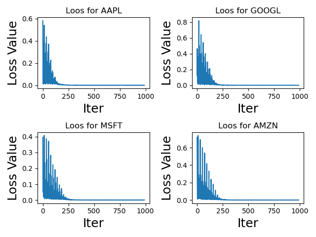

# Pytorch-lstm-stock-predict
Stock prediction on kaggle datasets

## Datasets

[基于kaggle的DJIA数据集](https://www.kaggle.com/datasets/szrlee/stock-time-series-20050101-to-20171231/code)

## Previous Model

[原model地址](https://github.com/Violettttee/Pytorch-lstm-attention)

原模型使用**单个model**完成对四种类型房间（bedrooms）的价格预测

## Temp Model

当前的model对不同的股票**分别创建model**进行拟合，整体来看效果更好，且甚至不需要使用attention机制。

## Result

### Loss

**训练集上的loss变化**

### Predict

**在测试集上的验证效果**

### 

## Use

使用方法：运行main程序即可，需要先设置train为True，可以通过设置evaluate为True开启在测试集上的验证，如果要训练自己的模型请设置train为True。

